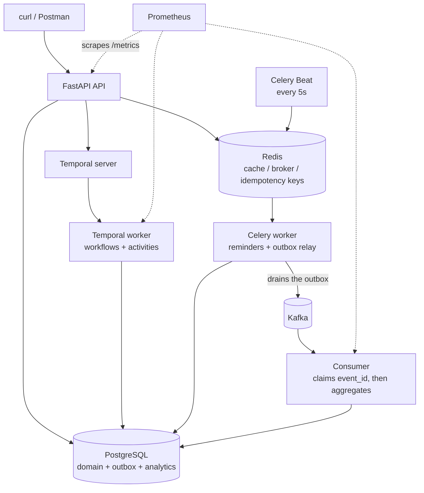

# SmartHealth

A backend for healthcare **operations** and patient engagement: appointments,
provider schedules, services and simulated billing pre-checks — plus (from Week 4)
an AI layer that helps patients find the right service.

This is deliberately **not** a clinical system. There are no diagnoses,
prescriptions, lab results or medical records anywhere in it, and the AI
assistant refuses to give medical advice by design.

It is also **API only**. There is no UI; Swagger UI at `/docs`, curl or Postman
is the interface.

> Status: **Week 2 complete** — Temporal workflows, scheduling and slots. See
> [Project status](#project-status) for what works today.

---

## What problem it solves

| # | Problem | Addressed by |
|---|---|---|
| 1 | Bookings are slow, and two patients can hold the same slot | Atomic slot reservation + a Temporal scheduling saga (Week 2) |
| 2 | Patients can't find the right service | Retrieval-augmented assistant (Weeks 4–5) |
| 3 | Dashboards disagree with the tables | Pre-aggregated analytics maintained by an event consumer, plus a reconciliation script (Week 3) |
| 4 | Peak-window timeouts | Slot reservation, billing and reminders moved out of the HTTP request (Weeks 2–3) |
| 5 | Background failures are invisible | Structured logs with a correlation ID, `/metrics`, and a dead-letter table (Week 3) |

---

## Architecture



Nothing but the Celery relay talks to Kafka. Events are written to an outbox
table in the same transaction as the change that caused them, and the relay
publishes from there — see `docs/events.md`.

**Division of labour.** Temporal owns the multi-step durable workflows (service
publishing, the appointment scheduling saga). Celery owns fire-and-forget work
(reminders) and the periodic outbox relay. The visit lifecycle is neither — it is
a plain validated status flow driven by human actions.

The ERD lives in `docs/design.md`; exported copies of every diagram are in
`docs/diagrams/`.

---

## Running it

**Prerequisites:** Docker Desktop. Nothing else — no local Python needed.

```bash
# 1. configure
cp .env.example .env
python -c "import secrets; print(secrets.token_urlsafe(48))"   # paste into JWT_SECRET

# 2. start. `--build api` alone gives postgres + redis + api, which is enough
#    for Week 1's domain; booking and publishing also need the Temporal server
#    and worker, so from Week 2 on start everything
docker compose up -d --build

# 3. build the schema
docker compose exec api alembic upgrade head

# 4. load a synthetic demo dataset (clinic, departments, providers + schedules,
#    published services, patients) -- idempotent, safe to re-run
docker compose exec api python -m scripts.seed

# 5. check
curl http://localhost:8000/health
```

Then open <http://localhost:8000/docs>.

| Command | What it does |
|---|---|
| `docker compose up -d --build api` | API + Postgres + Redis |
| `docker compose up -d` | the above + Temporal and its UI (Week 2) |
| `docker compose --profile week3 up -d` | the above + Kafka, Kafka UI, Prometheus (Week 3) |
| `docker compose logs -f api` | tail the API logs |
| `docker compose down` | stop, keep data |
| `docker compose down -v` | stop and wipe all data |

### Where things listen

Ports differ depending on whether you are inside the Compose network or on your
own machine. Using `localhost` from inside a container is the most common mistake
in this project.

| Service | From a container | From your machine |
|---|---|---|
| API | `api:8000` | <http://localhost:8000> |
| Postgres | `postgres:5432` | `localhost:5432` |
| Redis | `redis:6379` | `localhost:6379` |
| Temporal | `temporal:7233` | `localhost:7233` |
| Temporal UI | — | <http://localhost:8233> |
| Kafka | `kafka:9092` | `localhost:29092` |
| Kafka UI | — | <http://localhost:8080> |
| Prometheus | `prometheus:9090` | <http://localhost:9090> |

---

## Database migrations

Alembic owns the schema. There is no `create_all()` in the codebase — a clean
clone builds the whole database with `alembic upgrade head` and nothing else.

Run Alembic **inside the container**, because `DATABASE_URL` uses the hostname
`postgres`, which only resolves on the Compose network:

```bash
docker compose exec api alembic upgrade head                        # apply
docker compose exec api alembic current                             # where am I?
docker compose exec api alembic history                             # the chain
docker compose exec api alembic revision --autogenerate -m "add X"  # draft a migration
docker compose exec api alembic downgrade -1                        # undo one
```

Always read an autogenerated migration before applying it, and always write a
working `downgrade()`.

---

## Tests

The suite runs entirely inside Docker — nothing is installed on the host, and no
network access is required.

```bash
make test        # the whole suite, from cold
make test-cov    # with a coverage report
```

`make test` runs `docker compose run --rm test`: a one-shot container that starts
Postgres itself and exits with pytest's exit code. Unlike
`docker compose exec api pytest`, it does **not** need the API container to
already be running, which is what makes it usable from a cold checkout and in CI.

Without `make` (or on Windows, where MSYS `make` can mangle arguments to the
Docker CLI), run the same thing directly:

```bash
docker compose run --rm test
docker compose run --rm test pytest --cov=app --cov-report=term-missing
```

Run `make help` to list every target (`up`, `migrate`, `seed`, `lint`, `fmt`,
`psql`, `reset`).

Target is ≥25 meaningful tests and ≥80% coverage; the suite stands at 264 tests
and 98% coverage, no network access required. The hard cases are covered as they
land: 50 threads racing one slot, a repeated idempotency key producing one
appointment and one billing row, the saga compensating a billing failure, a failed
reschedule leaving the original slot untouched, and every illegal jump in the visit
flow. Idempotent event handling arrives with Week 3.

---

## API overview

| Method | Path | Purpose | Access |
|---|---|---|---|
| GET | `/health` | Liveness | Public |
| GET | `/health/db` | Temporary: confirms the API can reach Postgres | Public |
| GET | `/docs` | Swagger UI | Public |
| POST | `/api/v1/auth/register` | Patient self-registration | Public |
| POST | `/api/v1/auth/login` | Issue a JWT | Public |
| GET | `/api/v1/auth/me` | Current authenticated user | Any role |
| POST/GET/PATCH | `/api/v1/departments`, `/departments/{id}` | Department CRUD | Admin write, any staff read |
| POST/GET/PATCH | `/api/v1/services`, `/services/{id}` | Service CRUD (always created `DRAFT`) | Admin write, any staff read |
| GET | `/api/v1/services/search` | Public catalog: published + offered, filterable | Public |
| POST/GET/PATCH | `/api/v1/providers`, `/providers/{id}` | Provider profile CRUD | Admin write, any staff read |
| POST/GET/PATCH | `/api/v1/providers/{id}/schedules`, `/schedules/{id}` | Weekly working-hours templates | Admin write, any staff read |
| POST | `/api/v1/providers/{id}/schedules/generate-slots` | Turn templates into bookable `Slot` rows, idempotent | Admin |
| POST | `/api/v1/services/{id}/publish` | Start the Temporal publish workflow (202 + workflow id) | Admin |
| GET | `/api/v1/services/{id}/publish-status` | Where the publish lifecycle stands | Any staff |
| POST | `/api/v1/appointments` | Start the scheduling saga (202 + id). Requires `Idempotency-Key` | Patient (self), front desk/admin (on behalf) |
| GET | `/api/v1/appointments/{id}` | Current booking state | Patient (own), any staff |
| POST | `/api/v1/appointments/{id}/cancel` | Release the slot, promote the waitlist | Patient (own), front desk/admin |
| POST | `/api/v1/appointments/{id}/reschedule` | Release old + reserve new, atomically | Patient (own), front desk/admin |
| POST | `/api/v1/waitlist` | Join a provider's queue | Patient (self), front desk/admin (on behalf) |
| GET | `/api/v1/appointments/{id}/visit` | Current visit state | Patient (own), any staff |
| POST | `/api/v1/appointments/{id}/visit/check-in` | Start the visit, idempotent | Front desk, provider, admin |
| POST | `/api/v1/appointments/{id}/visit/start` | Move to `IN_PROGRESS`, idempotent | Front desk, provider, admin |
| POST | `/api/v1/appointments/{id}/visit/complete` | Complete visit + appointment, idempotent | Front desk, provider, admin |

Cancel/reschedule, the visit lifecycle, analytics and the AI assistant are added
week by week and documented here as they land.

---

## Configuration

All configuration comes from environment variables. `.env.example` is committed
and kept accurate; the real `.env` is git-ignored and never committed.

| Variable | Purpose |
|---|---|
| `APP_ENV`, `LOG_LEVEL`, `LOG_FORMAT` | Runtime behaviour and logging |
| `DATABASE_URL` | Postgres connection string |
| `REDIS_URL` | Cache, idempotency keys, rate limiting |
| `CELERY_BROKER_URL`, `CELERY_RESULT_BACKEND` | Celery (Week 3) |
| `JWT_SECRET`, `JWT_ALGORITHM`, `ACCESS_TOKEN_EXPIRE_MINUTES` | Auth |
| `TEMPORAL_HOST`, `TEMPORAL_NAMESPACE`, `TEMPORAL_TASK_QUEUE` | Temporal (Week 2) |
| `KAFKA_BOOTSTRAP_SERVERS`, `KAFKA_CONSUMER_GROUP`, `KAFKA_TOPIC_PREFIX` | Events (Week 3) |
| `LLM_*`, `EMBEDDING_*`, `RETRIEVAL_*`, `AI_*` | AI layer (Weeks 4–5) |

See `.env.example` for the full list with defaults and comments.

---

## Project layout

```
app/
  main.py         app factory, middleware, routers
  core/           config, security, logging, dependencies, errors, metrics
  db/             declarative Base, engine, session
  models/         SQLAlchemy ORM — database shape only
  schemas/        Pydantic request/response models
  api/v1/         routers: parse input, call a service, shape the response
  services/       business rules
migrations/       Alembic revisions
tests/            unit/ and integration/
docs/             design, events, runbook, ai-layer, prd
scripts/          seed, reconcile_analytics, eval_retrieval
.claude/          working context for Claude Code (committed, see below)
Makefile          one target per task — run `make help`
```

The layering is the point: routers hold no business logic and no SQL, services
hold the rules, and an ORM object is never returned from an endpoint (it would
leak `password_hash` and patient data).

---

## Documentation

| Document | Contents |
|---|---|
| `docs/design.md` | Data model / ERD, module breakdown, publish workflow and scheduling saga, the slot concurrency approach, decisions and tradeoffs |
| `docs/events.md` | Every event: envelope, catalogue, topics, the outbox, and how a replay changes nothing |
| `docs/prd.md` | Requirements, milestones, and the requirement → implementation → test traceability table |
| `NOTES.md` | Working log and weekly tracking tables |

Planned, not yet written: `docs/runbook.md` (Week 3) and `docs/ai-layer.md`
(Weeks 4–5).

### `.claude/` — working context

Committed rather than ignored, so the conventions this project is held to are
reviewable like any other file.

| Path | Loads | Contents |
|---|---|---|
| `CLAUDE.md` | every session | Project summary, layering, the non-negotiables, working rules |
| `rules/data-model.md` | editing `app/models/**`, `migrations/**` | Table list, enum/timestamp/migration conventions |
| `rules/workflows-and-sagas.md` | editing `app/temporal/**`, `app/services/**` | Slot atomicity, idempotency, publish workflow, scheduling saga |
| `rules/events-observability.md` | editing `app/events/**`, `app/workers/**`, `app/core/**` | Event envelope, Celery retries, analytics, logging/metrics |
| `rules/ai-layer.md` | editing `app/ai/**` | Chunking, retrieval filters, refusal rules, streaming |
| `rules/testing.md` | editing `tests/**` | Coverage targets, fixture design, what must be tested |
| `reference/*.md` | never automatically — grepped on demand | The three assignment briefs, converted from `.docx` by `scripts/convert_briefs.py` |
| `skills/` | on demand | `start-day`, `verify`, `verify-endpoint`, `stacked-pr`, `assignment-brief`, `explain` — see below |

Splitting it this way keeps the always-loaded file at 173 lines instead of 587:
the Week 4 retrieval rules no longer load while writing a Week 2 Temporal activity,
and the 1,250-line source briefs are searchable without ever being loaded in full.

#### Skills

| Skill | Does |
|---|---|
| `/start-day` | Picks up a day's work: reads the NOTES.md handoff, pulls the week's task table, loads that week's rules, starts the branch |
| `/verify` | Lint, docstrings, status codes, tests, coverage — run before every commit |
| `/verify-endpoint` | Live curl round-trip against the running container |
| `/stacked-pr` | The daily branch/PR chain and its retarget cascade |
| `/assignment-brief` | Where the briefs are and how to search them |
| `/explain <n>` | Re-explains the last *n* responses in plain, beginner-level English |

The briefs are living documents — re-run `python scripts/convert_briefs.py` on the
host after the `.docx` originals change. The converted files are generated; don't
hand-edit them.

---

## Project status

| Week | Theme | Status |
|---|---|---|
| 1 | Foundation and core domain | Done |
| 2 | Temporal workflows, scheduling, slots | Done |
| 3 | Celery, Kafka, observability | Not started |
| 4 | Chunking, embeddings, retrieval | Not started |
| 5 | AI assistant, streaming, demo | Not started |

**Working today:** everything from Week 1 (auth and roles, department/service/
provider CRUD, schedules and idempotent slot generation, public service search,
synthetic seed), plus all of Week 2 — service publishing as a Temporal workflow,
the concurrency-safe atomic slot reservation, the scheduling saga with
compensation, booking idempotency, the simulated billing pre-check, cancel and
reschedule with waitlist promotion, and the visit lifecycle. 264 tests at 98%
coverage.

**Known limitations:** the saga's compensation is covered as two halves plus a
live demonstration rather than one end-to-end test; a booking whose workflow
fails to start because Temporal is unreachable stays `REQUESTED` with nothing to
retry it; overlapping provider *schedule* windows are not prevented, only the
overlapping slots they would generate. See `docs/prd.md` §7.

**Not built yet:** Celery/Kafka, analytics, and the AI layer — Weeks 3–5.
