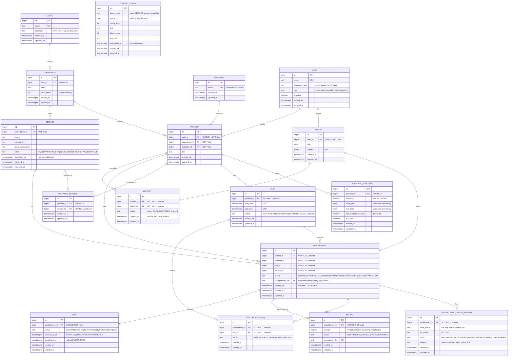
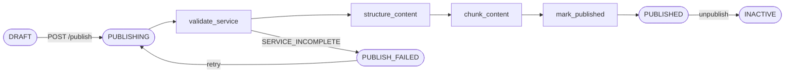
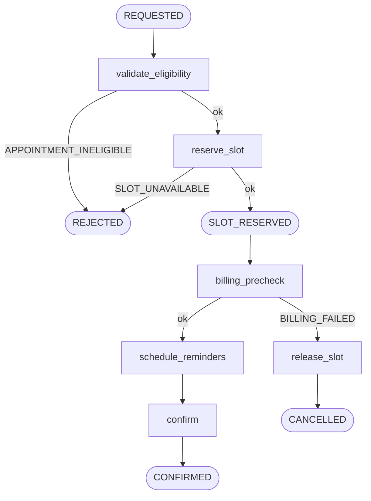

# Design

How SmartHealth is put together, and why. Updated as work lands.

- [1. Data model](#1-data-model)
- [2. Three things that will bite in Week 2](#2-three-things-that-will-bite-in-week-2)
- [3. Decisions and tradeoffs](#3-decisions-and-tradeoffs)
- [4. Open questions](#4-open-questions)
- [5. Module breakdown](#5-module-breakdown)
- [6. Publish workflow and scheduling saga](#6-publish-workflow-and-scheduling-saga) *(Week 2)*
- [7. Slot concurrency](#7-slot-concurrency) *(Week 2)*

---

## 1. Data model

### 1.1 ERD — core domain through Week 2

Seventeen entities. The ten Week 1 shapes plus everything the scheduling saga and
visit lifecycle attach to them.



Exported copies of this and every other diagram here live in `docs/diagrams/`.

**Conventions applied to every table.** Integer (`bigint`) identity primary keys.
`created_at` / `updated_at` as `timestamptz`, always UTC-aware — never a naive
datetime. Every foreign key is `ON DELETE RESTRICT`: in healthcare operations you
deactivate, you never delete, and a cascade that quietly removed a department's
services would take their history with it. Status is always an enum, never a
boolean flag. Indexes on anything filtered or joined: `slots.provider_id`,
`slots.status`, `services.status`, `services.department_id`,
`providers.department_id`.

### 1.2 What each table is — and is not

**Clinic** — the physical site that owns departments. It is *not* a tenant
boundary: multi-clinic sync is explicitly out of scope, and no query is scoped by
clinic. It exists as a table rather than a string on `departments` so the name is
stored once, and it carries `timezone` because it is the only place that knows how
to turn a provider's local working hours into UTC slot boundaries.

**Department** — an organisational grouping inside a clinic that owns both
providers and services. It is *not* a specialty: a department groups people and
offerings ("Orthopaedics"), while a specialty describes one provider's expertise.
Keeping them separate means a department can hold providers of several specialties
without either concept having to stretch.

**Specialty** — a controlled vocabulary of provider expertise. It is *not*
clinical content: it describes a provider, never a patient, and nothing here
diagnoses anything. It is a table rather than a free-text column because Week 4
retrieval filters on specialty as vector metadata, and "Cardiology" vs
"cardiology" vs "Cardiolgy" as three distinct values would silently break that
filter. The cost is one join and a seeded list.

**User** — an identity: the thing that logs in. It is *not* a person's record.
Role-specific facts live on `patients` and `providers`, so this table stays the
same shape for every role and never carries columns that are null for half its
rows. A `User` row is never serialised to a client — it holds `password_hash`.

**Patient** — the patient's operational profile. It is *not* a medical record:
`dob` and `contact` only, with no diagnoses, prescriptions, lab results or
clinical notes anywhere in the system. `contact` is PHI, so it is written to the
database and nowhere else — logs, events and `ai_interactions` carry `patient_id`.
It is JSONB rather than columns because contact details are a shifting bag of
phone / email / preferred channel, validated by a Pydantic model at the schema
layer so it does not become a junk drawer.

**Provider** — the clinician's operational profile: who they are, where they sit,
what they specialise in. It is *not* a schedule and *not* availability. Provider
time lives entirely in `provider_schedules` (the intent) and `slots` (the
concrete, bookable reality).

**ProviderSchedule** — a recurring weekly working-hours template in clinic-local
time, from which slots are generated in bulk. It is *not* availability itself:
nothing is bookable until a `Slot` row exists. There is deliberately **no foreign
key from `slots` back to a schedule** — once generated, a slot is independent.
That is what makes "the provider changed their Tuesday hours" tractable: editing a
template affects only future generation runs and can never retroactively move or
delete a slot someone has already booked.

**Service** — an operational offering a patient can be pointed at: what it is,
what it costs the patient in preparation, whether it is currently offered. It is
*not* a clinical procedure record; `description` and `prep_instructions` are
logistics ("arrive 15 minutes early, bring previous imaging"), never clinical
advice. Its lifecycle is a `status` enum rather than an `is_published` boolean,
because Week 2 needs to distinguish "being published right now" and "publishing
failed" from "not published" — three states one boolean cannot hold.

**Slot** — one bounded interval of one provider's time, as a discrete row. It is
*not* a boolean `is_available` flag on the provider, and this is the single most
important shape in the system. A boolean has no identity, so an appointment cannot
point at it, no history can reference it, and two concurrent writers can both flip
it with nothing to conflict over. A row has a primary key an appointment can
reference, a `status` the database can arbitrate with one conditional `UPDATE`,
and a lifetime that can be audited. A slot is also *not* service-specific — it is
provider time; the service is chosen when the appointment is created.

**ProviderService** — a join table stating a fact nothing else in the schema can:
that this provider is qualified to deliver this service. *Not* inferred from a
shared `department_id` — a department groups people and offerings, it does not
certify who performs what. Added Day 3, ahead of Week 2's eligibility check and
task 1.8's `has_available_slots` search filter, both of which need the real
answer.

---

## 2. Three things that will bite in Week 2

These are Week 1 shapes chosen specifically because Week 2 depends on them. Getting
them wrong now means a schema rewrite mid-Temporal-week.

### 2.1 `slots.status` is an enum, because the concurrency guarantee needs something to guard on

The core invariant of the whole assignment is that reserving a slot is a **single
atomic conditional update**:

```sql
UPDATE slots SET status = 'RESERVED'
WHERE id = :slot_id AND status = 'AVAILABLE'
RETURNING id;
```

No row returned means someone else got there first, and the booking is rejected
cleanly. The `WHERE status = 'AVAILABLE'` clause is the entire guarantee — it is
what makes the statement a compare-and-swap rather than a blind write, and it
requires a status column on the row being updated.

`SELECT` the slot, check it in Python, then `UPDATE` is **not** acceptable: two
requests both read `AVAILABLE`, both conclude the slot is free, and both book it.
The gap between the check and the act is the bug, and no amount of application
code closes it. The database must be the arbiter.

Four values, because Week 2's saga needs to distinguish them:

| Status | Meaning |
|---|---|
| `AVAILABLE` | Generated and bookable. The only status the reservation UPDATE will accept. |
| `RESERVED` | Held by an in-flight booking saga. Not yet confirmed — may be released by compensation. |
| `BOOKED` | The saga completed; a confirmed appointment owns this slot. |
| `BLOCKED` | Provider time off. Never bookable, and never becomes `AVAILABLE` by itself. |

`RESERVED` and `BOOKED` must be separate: compensation after a billing failure has
to release the slot back to `AVAILABLE`, and it can only know that is safe if the
status says the booking never completed.

### 2.2 One provider cannot have two overlapping slots

Two slots that overlap in time are two separate rows, so the atomic UPDATE above
protects neither from the other — both can be reserved, and the provider is
double-booked with no constraint violated anywhere. The invariant has to be
enforced where the rows are, in the database.

A unique constraint on `(provider_id, start_time)` is the obvious move and it is
worth having, but on its own it is **not sufficient**: 09:00–09:30 and 09:15–09:45
have different start times, so the constraint permits both.

**Decision: enforce overlap properly with a Postgres exclusion constraint**, and
keep the unique constraint alongside it for the common case, where it produces a
clearer error.

```sql
CREATE EXTENSION IF NOT EXISTS btree_gist;

ALTER TABLE slots ADD CONSTRAINT ck_slots_end_after_start
    CHECK (end_time > start_time);

ALTER TABLE slots ADD CONSTRAINT uq_slots_provider_id_start_time
    UNIQUE (provider_id, start_time);

ALTER TABLE slots ADD CONSTRAINT ex_slots_no_overlap
    EXCLUDE USING gist (
        provider_id WITH =,
        tstzrange(start_time, end_time) WITH &&
    );
```

The extension goes in via an Alembic migration, exactly as pgvector did — never by
hand on a running database. This is the same principle as the reservation UPDATE:
state the rule once, where the data is, rather than hoping every code path that
inserts a slot remembers to check.

### 2.3 `services.status` + `published_at` give the Week 2 Temporal workflow a state machine

Publishing a service is a Temporal Workflow, not a boolean flip:

```
DRAFT ──publish──> PUBLISHING ──success──> PUBLISHED ──unpublish──> INACTIVE
                        └──failure──> PUBLISH_FAILED ──retry──> PUBLISHING
```

The workflow validates the service is complete, structures its operational
content, chunks it, embeds it (Week 4) and marks it published. That takes real
time and can fail partway, so the row has to be able to say *"a publish is running
right now"* and *"the last publish failed"* — states an `is_published` boolean
cannot represent. `PUBLISHING` is also what makes the endpoint honest: `POST
/services/{id}/publish` returns `202` plus a workflow id, and
`GET /services/{id}/publish-status` reports where it got to.

Two consequences already baked into the Week 1 schema:

- Illegal entry transitions (publishing something already `PUBLISHING`) are
  rejected with `409` in one place *before* the workflow starts, which requires
  the current status to be readable on the row.
- `published_at` is nullable and set only on success. It is the timestamp Week 4's
  retrieval filter reads alongside `status = 'PUBLISHED'` — never recommend a
  service the clinic does not currently offer.

The status column exists in Week 1 even though nothing moves it yet. That is
deliberate: the state machine is a schema decision, and adding it later would mean
migrating rows that had already been created without it.

---

## 3. Decisions and tradeoffs

| Decision | Why | Tradeoff |
|---|---|---|
| `users` split from `patients` / `providers` (table-per-role) | Role-specific columns can be `NOT NULL` — `providers.department_id` is a real enforced rule, which it could never be on a merged table full of nulls | Every "who is this?" query joins; creating a patient touches two tables in one transaction |
| FK on the dependent side (`patients.user_id`), with `UNIQUE` | A user may have no patient profile; putting `patient_id` on `users` would need two nullable columns plus a constraint saying "exactly one is set". `UNIQUE` on the FK is what makes it 1:1 rather than 1:N | The 1:1 is enforced by a constraint a reader has to notice, not by the column's position |
| A patient must have a user account | Simpler auth, and PHI scoping keys off the authenticated user with no second path | No walk-in patients without a login; front desk must create an account to register someone |
| One user may hold both a patient and a provider profile | A clinician can be a patient at their own clinic; forbidding it buys nothing | `role` is a single value, so such a user's role has to pick one — resolved in the service layer |
| Single `role` enum, not a `user_roles` join table | Specified by the brief, and four roles with no overlap in practice | Someone genuinely needing two roles needs two accounts |
| `Specialty` as an entity, not a string | Week 4 filters retrieval on specialty metadata; free text makes "Cardiology"/"cardiology" different values and silently breaks the filter | An extra join and a seeded vocabulary to maintain |
| `Clinic` as an entity, not a string on `departments` | Stores the name once and gives the timezone a home — schedule templates are local, slots are UTC, and something has to own the conversion | An extra table for what is one row in Week 1 |
| `ProviderSchedule` template, with slots generated from it | The week's brief is "provider schedules"; a template expresses recurring intent once instead of restating working hours on every generation call | A second concept to keep coherent with the slots it produced |
| No FK from `slots` back to `provider_schedules` | Editing a template must never retroactively move or delete a slot someone has booked; once generated, a slot stands alone | Cannot ask "which template produced this slot?"; the link exists only in the generation run |
| `slot.status = BLOCKED` for time off, not a separate entity | The status enum already models "not bookable"; a second table would need reconciling with the slots it overlaps | Time off can only be expressed where slots have been generated |
| All FKs `ON DELETE RESTRICT` | Operations data is deactivated, never deleted — the same reason a cancelled appointment is transitioned rather than removed | Deleting test data by hand needs the right order |
| `patients.contact` as JSONB | Contact details are a shifting bag of phone / email / preferred channel; the brief specifies JSONB and rules out a second database | Not queryable as columns; needs a Pydantic model at the schema layer or it becomes a junk drawer |
| Enums stored as `VARCHAR` + `CHECK`, not a native Postgres `ENUM` type | Status values get added and renamed as the workflows are built, and a native enum has no clean reversal — Postgres has no `DROP VALUE`, so downgrading a value addition means recreating the type and re-casting the column. A check constraint is symmetric to add and drop, so migrations stay reversible | Slightly more storage; `ORDER BY status` sorts alphabetically rather than by lifecycle order; the vocabulary cannot be shared as one type across tables |
| Integer identity primary keys | Event envelopes carry ids (`"appointment_id": 812`), which stay readable in logs and demos; integer joins are cheaper | Ids are enumerable, so access control must be real authorization, never obscurity |
| Slots stored in UTC, schedules in clinic-local time | Naive local datetimes are on the assignment's list of common mistakes; a single stored timezone means one conversion point | Reading raw slot rows during a demo needs a mental offset |
| 15-minute default slot duration | Confirmed with mentor for seed data | — |
| Slot overlap prevented by a Postgres `EXCLUDE`, not only by `UNIQUE (provider_id, start_time)` | Two slots that overlap have *different* start times, so the unique constraint permits them; checking in the generator is the same check-then-act gap as SELECT-then-UPDATE. `EXCLUDE` is evaluated as part of the insert, so there is no window | Needs the `btree_gist` extension; its GiST index answers overlap questions but serves ordered range scans poorly, so the unique constraint is kept alongside it for that index |
| Email uniqueness enforced on `lower(email)` | Postgres compares text byte-for-byte, so a plain unique constraint would let one person hold two accounts differing only in capitalisation, each with its own patient row and booking history. Enforcing it in the database means a seed script or psql session cannot bypass it | Every lookup must be written `WHERE lower(email) = :email` or the index is not used |
| `weekday` is `0 = Monday`, matching Python's `date.weekday()` | The slot generator is Python walking dates; the Postgres `EXTRACT(DOW)` convention would put a `+1 % 7` in the hottest logic of Week 1, and an off-by-one there produces slots on the wrong days with no error at all | Disagrees with `EXTRACT(DOW)` if the column is ever read from raw SQL; guarded by `CHECK (weekday BETWEEN 0 AND 6)` and stated on the column |

### Week 2

| Decision | Why | Tradeoff |
|---|---|---|
| A separate `slot_reservations` table, rather than inferring the hold from `appointments.status` | The reserve must survive a crash between the UPDATE and the status write; a status column set in a later statement cannot record that window | A second row per booking attempt, and a table that only exists to make one Activity idempotent |
| `reserve_slot` split into an uncommitted core plus a committing wrapper | Lets the saga's Activity share one transaction with its own `slot_reservations` insert, so the flip and the record commit together | Two functions where callers might expect one; the uncommitted one is a footgun if called directly |
| Deterministic workflow ids (`publish-service-{id}`, `schedule-appointment-{id}`) | Temporal rejects a second execution under a live id, which is a second guard against a concurrent double-publish independent of the status check | An id already used cannot be reused after completion without a policy decision |
| Booking idempotency in Redis **and** a unique constraint on `appointments.idempotency_key` | Redis answers "seen this key" before any row exists; the constraint is the last-resort guarantee if Redis is evicted or unavailable | Two mechanisms to keep in step, and a race between them handled by catching the unique violation |
| `get_redis` as a FastAPI dependency, not a module-level import | Tests can point route code at the test Redis database exactly as they do with `get_db`; without it the suite writes 24h-TTL keys into the app's real Redis and fails on its *second* run | One more dependency threaded through the endpoint signature |
| Each compensation written out explicitly, not behind a generic mechanism | The failure modes differ — two need no compensation at all — and a generic runner would hide that asymmetry | Repetition in the Workflow body; a fourth failure mode means another explicit branch |
| Patient resolution ("self or on behalf of") in `services/patient.py`, not in the routers | Booking and waitlist-joining ask the identical question, and a duplicated access-control rule is how one copy silently drifts | An extra indirection between the router and the thing it is creating |
| Waitlist entries point at a provider, not a slot | Someone joining a queue does not know which slot will free up, only whose time they want; a per-slot queue dies the moment that slot is booked | Cannot express "I only want Tuesday mornings" |
| Waitlist uniqueness is a **partial** index (`WHERE status = 'WAITING'`) | An `OFFERED` entry is history and must not block a fresh join; a plain unique index would lock a patient out of that queue permanently after their first offer | Partial indexes are easy to lose in an autogenerated migration — pinned by a test that rejoins after an offer |
| Queue position is `(created_at, id)`, not a position column | A position needs renumbering whenever anyone leaves, and Postgres `now()` is transaction-scoped so timestamps alone can tie | Relies on `id` ordering matching arrival order, which sequences give but do not promise under concurrency |

### Week 3

| Decision | Why | Tradeoff |
|---|---|---|
| `processed_events` is keyed on `(consumer, event_id)`, not `event_id` alone | Idempotency is per-consumer: each consumer must handle an event exactly once. Keyed on `event_id` alone, adding a second consumer would make it skip every event the first had already seen — silently, and looking exactly like correct de-duplication. Appendix B lists `consumer` as a column but not as part of the key; a column recorded and never enforced is a fact the schema does not actually hold | The key is wider, and every lookup must supply the consumer name — a handler that forgets it gets no rows rather than an error |
| No `processed_at` column; `created_at` is that moment | The marker row and the aggregate update commit in the same transaction, so the two timestamps could only ever hold the same value. Same reasoning as `outbox_events.created_at` doubling as the envelope's `occurred_at` | A reader expecting Appendix B's column list has to be told; stated in the model docstring |
| Composite primary key, no surrogate `id` | Nothing references this table by foreign key and the pair is already unique, so an `id` would identify nothing that `(consumer, event_id)` does not. Same reasoning as `analytics_daily` keying on `date` | Inserting a row means knowing both parts of its identity; there is no short handle to quote in a log line |
| The Kafka consumer is the only writer of `analytics_daily`; the Celery Beat rollup is retired | A five-minute recompute overwrote the consumer's increments, and a check that writes can never report drift | A missed event stays wrong until 3.7's reconciliation is run |
| `avg_wait_seconds` replaced by `wait_seconds_total` + `wait_count` | An average cannot be incremented — it has forgotten how many values produced it. Its two components can | The division moves to read time, so anything reading the table directly must do it too |
| Total patients and failed jobs are counted directly, not stored as aggregates | No event announces either, so no aggregate could be kept current, and a stored copy would duplicate a number the source table already holds | Two of the six metrics are not served from aggregates, which the Definition of Done words as though all six are |
| The duplicate guard is `ON CONFLICT DO NOTHING … RETURNING`, not a caught `IntegrityError` | A violated constraint aborts the whole transaction — the one the handler still has to run in | Postgres-specific; the guard would not port to another database unchanged |
| A permanent failure dead-letters and then commits the offset; a transient one rewinds with `seek` | An offset is a position rather than a checklist, so refusing to move it blocks every message behind one bad one | Misclassifying a failure either loses an event or stalls a partition |
| Handlers bucket by the raw column the reconciliation reads, not the envelope's `occurred_at` | The two are microseconds apart, but either side of midnight they disagree, and the check would report drift that was never real | Each event costs a lookup of the row it is counting |
| The analytics series is not paginated; a 366-day range cap bounds it instead | Paginating a chart makes the client reassemble it, and `total` would only restate the number of days it asked for | Deviates from the project-wide `{items, total, limit, offset}` convention for list endpoints |

**Enum member names and values are kept identical** (`AVAILABLE = "AVAILABLE"`).
SQLAlchemy persists a Python enum's `.name`, while a `str`-based enum serialises
its `.value` through Pydantic — so if the two differ, the database holds one
string and the API returns another, and a hand-written query in the runbook
silently matches nothing.

**The check constraint is not automatic.** SQLAlchemy's `Enum(...)` defaults to
`create_constraint=False`, which produces an unconstrained `VARCHAR` — the enum
would then guarantee nothing in the database, and a seed script or psql session
could write any string at all. Every enum column is therefore built through one
helper in `app/models/enums.py` that sets the flag, so it cannot be forgotten on
one column out of three.

**Resolved: `providers` and `services` are linked via `provider_services`.** This
was originally recorded as a known gap deferred to Week 2 (a shared department
alone doesn't certify who performs what — a dermatology service and a
cardiologist could otherwise pair up with nothing to stop it). Built ahead of
schedule on Day 3, once task 1.8's search filters made the gap concrete: a
genuine many-to-many, not inferred from department.

**Known gap: overlapping *schedule* windows for one provider are not prevented.**
Mon 09:00–12:00 and Mon 11:00–14:00 can both be stored. Postgres ships no range
type for `time`, and creating a custom one would be exactly the hand-maintained
database object rejected when choosing enum storage. The invariant that matters
— no provider double-booked — is enforced where it matters: overlapping windows
can only cause harm by producing overlapping slots, and that insert is rejected
by `ex_slots_no_overlap`. The cost is that the failure surfaces at generation
time rather than at schedule-creation time; a service-layer check should point
at the right place.

**`status = 'PUBLISHED'` and `published_at IS NOT NULL` are not the same fact.**
`published_at` means "when it last went live", not "it is live now" — an
`INACTIVE` service keeps its timestamp. They are deliberately not tied together
by a constraint. Always read `status` for liveness; never infer it from
`published_at`.

**Known gap: nothing at the database level ties `users.role` to which profile table
a user has.** A user with `role = 'patient'` could in principle have a provider row
and no patient row. Enforced in the service layer at creation, and covered by a
test.

**Known gap (Week 2): a booking whose workflow never started stays `REQUESTED`.**
The row is committed before `start_workflow` is called, so if Temporal is
unreachable at that moment nothing retries it and no compensation runs — deleting
the row is not an option. A retry with the same `Idempotency-Key` returns the
stuck appointment rather than restarting the saga. A sweeper for rows left
`REQUESTED` past a threshold is the fix; the same window exists in
`start_publish`, where the status is rolled back but the gap is identical.

**Known gap (Week 2): cancel, reschedule and the visit lifecycle are not built.**
Tasks 2.10 (partly) and 2.11, carried into Week 3. Consequently the waitlist can
be joined but nothing promotes an entry to `OFFERED`, because promotion is what
cancellation triggers.

---

## 4. Open questions

- Confirm a single clinic is sufficient for Week 1 — assumed yes.
- Confirm treating slots as the schedule (generated from templates) rather than
  computing availability on the fly is the expected shape.

---

## 5. Module breakdown

```
api/v1/    auth, departments, services (+ public /search), providers,
           provider_schedules (+ generate-slots). Parse input, call a
           service, shape the response — no business logic, no SQL.
services/  Business rules: uniqueness checks, role/ownership checks,
           slot generation. One module per api/v1 router, same name.
models/    SQLAlchemy ORM. Database shape only.
schemas/   Pydantic request/response. No ORM object ever leaves an endpoint;
           writable schemas omit any field only a workflow may set (e.g.
           Service.status).
core/      config, security (bcrypt + JWT), dependencies (get_current_user,
           require_role, ensure_patient_self_or_staff), exceptions +
           error_handlers (one JSON error shape), pagination.
```

Every router endpoint is admin/staff-gated with `require_role` except
`GET /services/search`, which is deliberately public — a prospective patient
browsing before they register is the point of task 1.8.

## 6. Publish workflow and scheduling saga

Both run on Temporal. A Workflow function orchestrates and nothing else — no
clock, no `random`, no database, no network — because Temporal replays it on
recovery and it must make the same decisions every time. All I/O lives in
Activities, which can be retried at any point and are therefore idempotent.

Activities are methods on a class holding an injectable `session_factory`, not
bare functions: an Activity has no `Depends(get_db)` to override, so that
factory is how a test points them at the test database.

### 6.1 Service publishing



`validate_service` returns every missing field at once and is **non-retryable** —
a missing description is still missing on the next attempt. That failure is
expected, so the Workflow catches it and ends cleanly in `PUBLISH_FAILED`;
anything else is left to Temporal's retry policy. `chunk_content` deletes and
re-inserts in one transaction, which is simultaneously how re-publishing replaces
chunks atomically and how a retried attempt stays idempotent.

### 6.2 Appointment scheduling saga



Three failures are expected rather than bugs, and each has its own exit:

| Failure | Compensation | Terminal state |
|---|---|---|
| Ineligible — service unpublished, provider doesn't offer it, slot isn't theirs | none; nothing was reserved | `REJECTED` |
| Slot lost to a competing booking | none; this appointment never held it | `REJECTED` |
| Billing pre-check fails | `release_slot` — slot back to `AVAILABLE`, reservation `RELEASED` | `CANCELLED` |

**Compensation is not rollback.** `reserve_slot` already committed, so undoing it
is a new write, not a transaction abort. The appointment row is never deleted.

Every transition writes `appointment_status_history` with an actor: `PATIENT` /
`FRONT_DESK` / `ADMIN` for human actions, `SAGA` for a saga step, and
`SAGA_COMPENSATION` for a rollback — so the audit trail distinguishes a
compensating write from an ordinary one.

How each Activity survives a retry:

| Activity | Retry-safe because |
|---|---|
| `validate_eligibility` | read-only |
| `reserve_slot` | checks for an existing `(appointment, slot)` reservation first |
| `billing_precheck` | `BillingChecker` reuses an existing billing row |
| `schedule_reminders` | no-op until Week 3 |
| `confirm` | returns early if already `CONFIRMED` |
| `release_slot` | returns early if already `CANCELLED` |
| `reject` | acts only from `REQUESTED` |

`GET /appointments/{id}` and `GET /services/{id}/publish-status` read the status
column rather than querying Temporal: the Activities keep it in sync at every
step. The cost is that a workflow lost before its first Activity leaves a row
claiming `REQUESTED` forever — see the known gaps in [3](#3-decisions-and-tradeoffs).

## 7. Slot concurrency

The atomic conditional UPDATE, and why SELECT-then-check-then-UPDATE races, are
in [2.1](#21-slotsstatus-is-an-enum-because-the-concurrency-guarantee-needs-something-to-guard-on).
Week 2 added three things on top.

**Proven, not asserted.** A test fires 50 threads at one slot and asserts exactly
one wins. It opens its own engine sized for 50 connections — the shared fixture's
default pool (5 + 10 overflow) would serialise most attempts before they reached
Postgres, and the test would pass while testing nothing.

**`slot_reservations` makes reserving retry-safe.** The UPDATE alone cannot tell a
retry from a fresh attempt: a retried Activity sees the slot already `RESERVED`
and would wrongly conclude a competitor won it. So `reserve_slot` checks for an
existing reservation row for that `(appointment, slot)` pair first. The UPDATE and
the insert commit together, so there is no window where the slot is flipped but
unrecorded — which is why `reserve_slot` is split into an uncommitted core and a
committing wrapper.

**Two different guarantees.** The UPDATE protects one row from two writers;
`ex_slots_no_overlap` ([2.2](#22-one-provider-cannot-have-two-overlapping-slots))
protects two rows from overlapping in time. Neither substitutes for the other.
